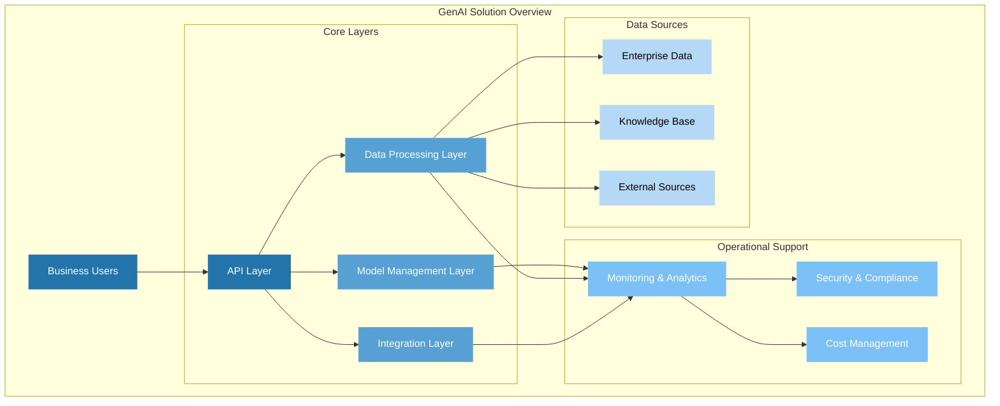

# Conceptual Architecture Diagram

This conceptual diagram illustrates the high-level components and their relationships in our GenAI solution. It emphasizes:

1. User interaction through a unified API layer
2. Core processing layers (Model Management, Data Processing, Integration)
3. Operational support systems (Monitoring, Security, Cost Management)
4. Data source integration