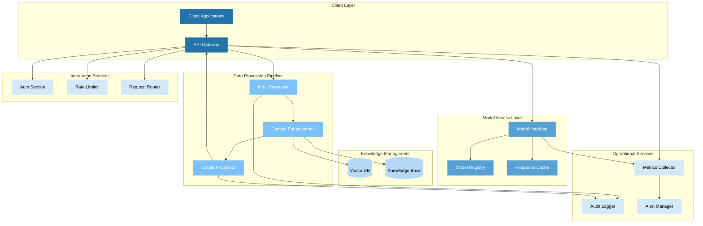

# Logical Architecture Diagram

```mermaid
graph TB
    subgraph "Client Layer"
        Client[Client Applications]
        Gateway[API Gateway]
        Client --> Gateway
    end

    subgraph "Model Access Layer"
        Registry[Model Registry]
        Interface[Model Interface]
        Cache[Response Cache]
        
        Gateway --> Interface
        Interface --> Registry
        Interface --> Cache
    end

    subgraph "Data Processing Pipeline"
        Input[Input Processor]
        Context[Context Enhancement]
        Output[Output Processor]
        
        Gateway --> Input
        Input --> Context
        Context --> Output
        Output --> Gateway
    end

    subgraph "Knowledge Management"
        VDB[(Vector DB)]
        KB[(Knowledge Base)]
        Context --> VDB
        Context --> KB
    end

    subgraph "Integration Services"
        Auth[Auth Service]
        Rate[Rate Limiter]
        Router[Request Router]
        
        Gateway --> Auth
        Gateway --> Rate
        Gateway --> Router
    end

    subgraph "Operational Services"
        Metrics[Metrics Collector]
        Logger[Audit Logger]
        Alert[Alert Manager]
        
        Gateway --> Metrics
        Interface --> Metrics
        Input --> Logger
        Output --> Logger
        Metrics --> Alert
    end

    classDef client fill:#2374ab,stroke:#2374ab,color:#fff
    classDef model fill:#57a0d3,stroke:#57a0d3,color:#fff
    classDef process fill:#7bc1f7,stroke:#7bc1f7,color:#fff
    classDef data fill:#b5d8f7,stroke:#b5d8f7,color:#000
    classDef ops fill:#d4e9f7,stroke:#d4e9f7,color:#000

    class Client,Gateway client
    class Registry,Interface,Cache model
    class Input,Context,Output process
    class VDB,KB data
    class Metrics,Logger,Alert,Auth,Rate,Router ops
```

This logical diagram shows:

1. Detailed component interaction
2. Data flow between services
3. Key integration points
4. Operational service connections