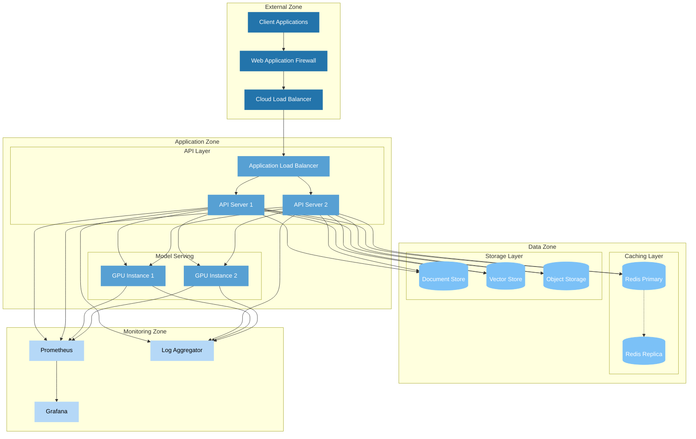

# Physical Architecture Diagram

This physical diagram details:

1. Infrastructure components and their relationships
2. Network zones and security boundaries
3. High-availability configurations
4. Monitoring and logging setup